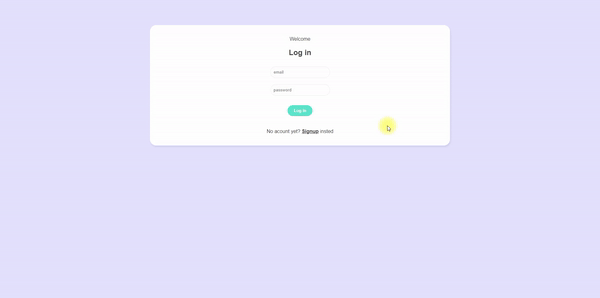

# Live Chat Application

## Overview
This live chat application provides a real-time communication platform. It allows users to sign up, log in, and participate in chat room, ensuring a seamless and user-friendly experience.

## Technologies Used
- **Vue.js**: A progressive framework for building user interfaces. [Vue.js Documentation](https://vuejs.org/)
- **Firebase**: A comprehensive app development platform by Google. [Firebase Documentation](https://firebase.google.com/)
- **JavaScript**: The programming language used to create dynamic and interactive web content. [JavaScript Documentation](https://developer.mozilla.org/en-US/docs/Web/JavaScript)
- **CSS**: For styling the web application. [CSS Documentation](https://developer.mozilla.org/en-US/docs/Web/CSS)
- **This Live Chat application is [hosted](https://vue-blog-abe6a.web.app/) using firebase.**

## Setup
1. Clone the repository to your local machine.
2. Navigate to the project directory.
3. Install dependencies: `npm install`.
4. Start the development server: `npm run serve`.

## Usage
- **Sign Up**: New users can create an account.
- **Login**: Existing users can log in to access the chat rooms.
- **Chat Room**: Users can join and participate in chat room.
- **Logout**: Users can log out of the application.

## Preview

